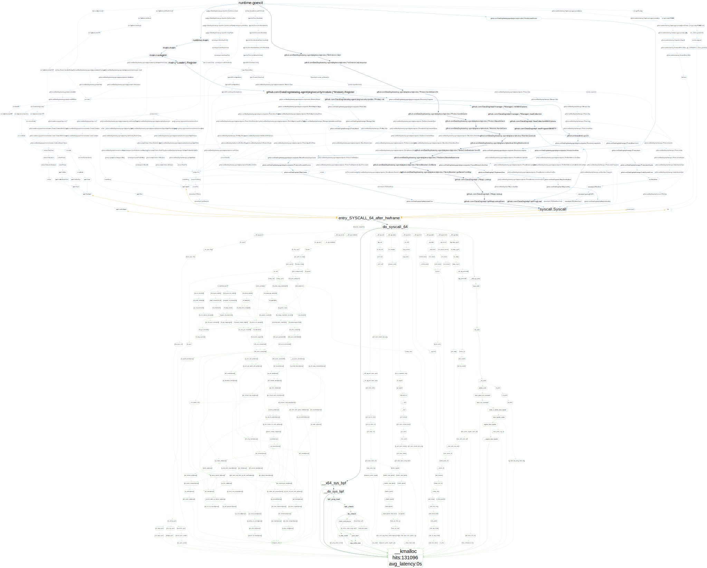
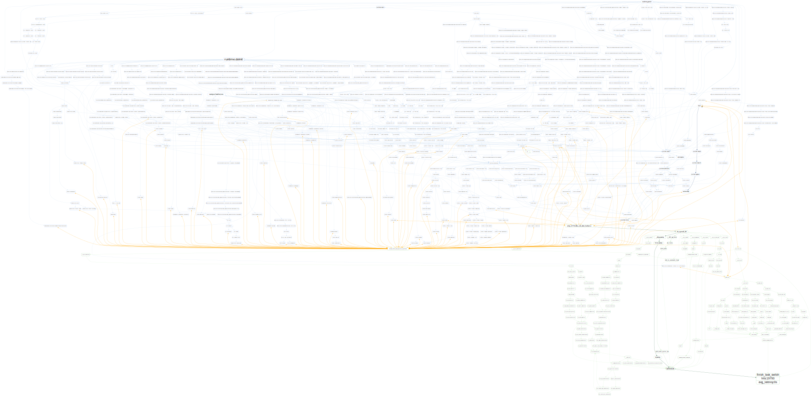
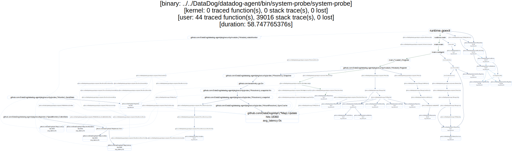
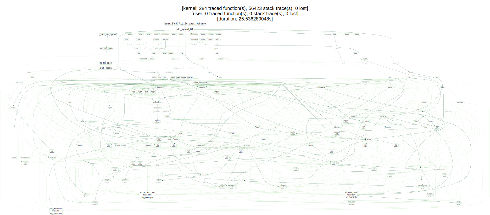
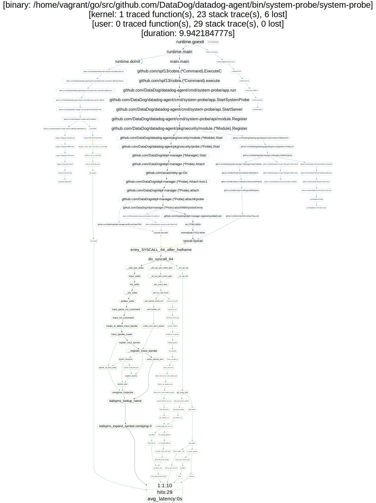

## UTrace

UTrace is a tracing utility that leverages eBPF to trace both user space and kernel space functions. You can configure it to collect stack traces leading to a predefined executable symbol (or a kernel space symbol). Once the stack traces are collected, UTrace can compile them into a dot graph to visualize user space / kernel space context switches as well as pinpoint the most triggered call paths by looking at the heat map color coding. For the traced functions, UTrace can also compute the latency of the functions.

### System requirements

- golang 1.13+
- This project was developed on an Ubuntu Focal machine (Linux Kernel 5.4) but should be compatible with 4.13+ kernels (not tested).
- Kernel headers are expected to be installed in `lib/modules/$(uname -r)`, update the `Makefile` with their location otherwise.
- clang & llvm (developed with 11.0.1)
- (optionnal) graphviz

### Build

1) If you need to rebuild the eBPF programs, use the following command:

```shell script
# ~ make build-ebpf
```

2) To build UTrace, run:

```shell script
# ~ make build
```

3) To install UTrace (copy to /usr/bin/uprobe) run:
```shell script
# ~ make install
```

### Getting started

UTrace needs to run as root. Run `sudo utrace -h` to get help.

```shell script
# ~ utrace -h
Usage:
  utrace [flags]

Flags:
  -b, --binary string           Path to the binary
  -g, --generate-graph          when set, utrace will generate a .dot graph with the collected statistics
  -h, --help                    help for utrace
  -k, --kernel-pattern regexp   kernel function(s) pattern to trace (default *)
  -t, --latency                 when set, utrace will use uprobes to compute functions latency
  -l, --log-level string        log level, options: panic, fatal, error, warn, info, debug or trace (default "info")
  -p, --pattern regexp          function(s) pattern to trace (default *)
      --pid int                 when set, utrace will add the provided pid to the list of traced pids. Leave empty to disable filtering.
  -s, --stack-traces            when set, utrace will use uprobes to collect functions stack traces
```

### Examples

#### Find memory allocations

1) Let's trace all the memory allocations of `system-probe` on start up (`system-probe` is one of the binaries of the Datadog agent). To do so, run the following command:

```shell script
# ~ sudo utrace --binary /home/vagrant/go/src/github.com/DataDog/datadog-agent/bin/system-probe/system-probe --generate-graph --kernel-pattern "(^__kmalloc$)"
INFO[2021-02-03T00:09:25Z] Tracing started on 1 symbols ... (Ctrl + C to stop)
```

2) Start `system-probe` and wait for a few seconds. On exit, utrace will dump all the collected stack traces to the screen and generate a dot graph in your temporary directory.

```shell script
[...]

63888 user space stack traces collected (0 lost)
63888 kernel space stack traces collected (0 lost)
Tracing lasted for 1m17.850732316s
INFO[2021-02-03T00:10:43Z] Graph generated: /tmp/utrace-dump-120828521
```

3) You can export the dot graph to an svg file using gaphviz.

```shell script
# ~ dot -Tsvg -o /tmp/utrace-dump-120828521.svg /tmp/utrace-dump-120828521
```



#### Track context switches

```shell script
# ~ sudo utrace --binary /home/vagrant/go/src/github.com/DataDog/datadog-agent/bin/system-probe/system-probe --generate-graph --kernel-pattern "(^finish_task_switch$)"
```



#### Trace eBPF map operations in system-probe

```shell script
# ~ sudo utrace --binary /home/vagrant/go/src/github.com/DataDog/datadog-agent/bin/system-probe/system-probe --generate-graph --pattern "github.com/DataDog/ebpf-manager.\(\*PerfMap\)|github.com/cilium/ebpf.\(\*Map\)"
```



#### Trace all overlay operations in the kernel

```shell script
# ~ sudo utrace --kernel-pattern "^ovl_" --generate-graph
```



#### Trace page faults in system-probe on startup

```shell script
# ~ sudo utrace --binary /home/vagrant/go/src/github.com/DataDog/datadog-agent/bin/system-probe/system-probe --generate-graph --tracepoint "exceptions:page_fault_user"
```


#### Trace task-clock perf event in system-probe on startup

```shell script
# ~ sudo utrace  --binary /home/vagrant/go/src/github.com/DataDog/datadog-agent/bin/system-probe/system-probe --generate-graph --perf 1:1:10
```

